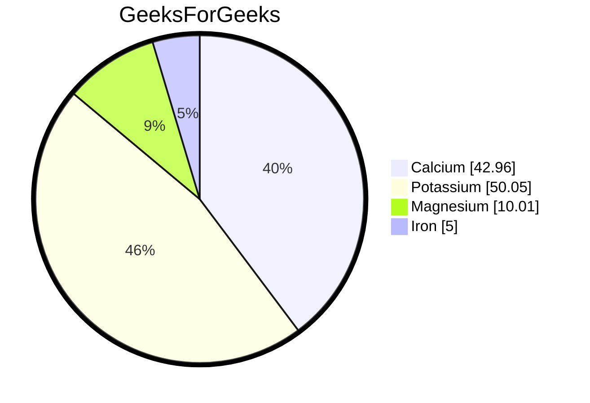

<!-- ### Hi there 👋


**raimanshu/raimanshu** is a ✨ _special_ ✨ repository because its `README.md` (this file) appears on your GitHub profile.

Here are some ideas to get you started:

- 🔭 I’m currently working on ...
- 🌱 I’m currently learning ...
- 👯 I’m looking to collaborate on ...
- 🤔 I’m looking for help with ...
- 💬 Ask me about ...
- 📫 How to reach me: ...
- 😄 Pronouns: ...
- ⚡ Fun fact: ... -->

  <!--  https://user-images.githubusercontent.com/25181517/121401671-49102800-c959-11eb-9f6f-74d49a5e1774.png
   

  https://user-images.githubusercontent.com/25181517/183568594-85e280a7-0d7e-4d1a-9028-c8c2209e073c.png -->

  <!-- HELP ::: https://github.com/rzashakeri/beautify-github-profile?tab=readme-ov-file -->

  <!-- ## Profile Activity Generator  -->
  <!-- ## Spotify Github Profile -->

<!-- ```mermaid
%%{init: {"pie": {"textPosition": 0.5}, "themeVariables": {"pieOuterStrokeWidth": "5px"}} }%%
pie showData
    title Key elements in Product X
    "Calcium" : 42.96
    "Potassium" : 50.05
    "Magnesium" : 10.01
    "Iron" :  5

 ``` -->

<!-- | Tables        | Are           | Cool  |
| ------------- |:-------------:| -----:|
| col 3 is      | right-aligned | $1600 |
| col 2 is      | centered      |   $12 |
| zebra stripes | are neat      |    $1 | -->

<div align="center"> 
<!-- 😄😏😎 -->

<span style="vertical-align:middle;">

##  **raimanshu** 

</span>
 </div>
 <div align="center">

[](https://linkedin.com/in/himanshu-rai-377306128)
[](https://github.com/raimanshu/raimanshu)
[](https://twitter.com/raimanshu96)
[](https://instagram.com/in/kiranshu.yaduvanshi)

 </div>
 <div align="center">

[](https://leetcode.com/raimanshu/)
[](https://auth.geeksforgeeks.org/user/raimanshu)

 </div>

<!-- ## About Me -->

### Hi there <a href="https://www.gautamkrishnar.com/"></a>

> Little bit about myself...

<table width="100%" >

 <tr>
    <td width="50%"><div>

- I am developer...👨‍💻...designer...👨‍🎨...batman...🦇
- Currently working on something cool 😁😎
- 🌱 I’m currently learning devops 🤯
- 💬 Ask me about anything related to
  - Designing
  - Frontend
  - Backend
  - Database
- ⚡ Fun fact: I like ::Anime 😍

  - Death Note, Naruto, One Piece, Fairy Tail, Blue Lock, Hunter x Hunter, JJK, Spy x Family, One Punch Man, Demon Slayer ... and much more !!

     </div></td>
      <td align="center" width="25%"  style="border:none;"><div>  </div></td>
   </tr>
  </table>

## My favorite tools and technologies ⚙️

> Tools and technologies that I have worked with and am interested in

<table>
  <tr>
     <td  align="center">
        
      <br>
      <p> React </p>
    </td>
     <td  align="center" >
      <a href="#macropower-tech">
        
      </a>
      <br>
         <p align="center"> Python </p>
    </td>
     <td  align="center"  >
        
      <br>
         <p align="center"> Javascript </p>
    </td>
     <td  align="center"  >
        
      <br>
         <p align="center"> MySQL </p>
    </td>
        <td  align="center"  >
        
      <br>
         <p align="center"> Flask </p>
    </td>
        <td  align="center"  >
        
      <br>
         <p align="center"> Github </p>
    </td>
           <td  align="center"  >
        
      <br>
         <p align="center"> Angular </p>
    </td>
           <td  align="center"  >
        
      <br>
         <p align="center"> Typescript </p>
    </td>
  <tr>
     <td  align="center"  >
        
      <br>
         <p align="center"> Git </p>
    </td>
     <td  align="center"   >
        
      <br>
         <p align="center"> HTML </p>
    </td>
     <td  align="center"  >
        
      <br>
         <p align="center"> CSS </p>
    </td>
     <td  align="center"   >
        
      <br>
         <p align="center"> Bootstrap </p>
    </td>
     <td  align="center"  >
        
      <br>
         <p align="center"> Tailwind </p>
    </td>
         <td  align="center"  >
        
      <br>
         <p align="center"> JQuery </p>
    </td>
         <td  align="center"  >
        
      <br>
         <p align="center"> Postman </p>
    </td>
             <td  align="center" >
        
      <br>
         <p align="center"> Linux </p>
    </td>
  </tr>
 <tr>
 </tr>
</table>

**\*\*\*\*** WIP \***\*\*\*\*\*\*\***

## My Social Media Handles

> Wanna get in touch ...

[](https://linkedin.com/in/himanshu-rai-377306128)
[](https://github.com/raimanshu/raimanshu)
[](https://twitter.com/raimanshu96)
[](https://instagram.com/in/kiranshu.yaduvanshi)

> For practice ... ... and more!

[](https://leetcode.com/raimanshu/)
[](https://auth.geeksforgeeks.org/user/raimanshu)

cssbattle - https://cssbattle.dev/player/raimanshu <br/>

## My Technical Statistics ⚙️

> LeetCode && GeeksForGeeks Status....

<table>
  <tr>
    <td>
      <pre class="mermaid"><code> 
pie showData
   title LeetCode
   "Easy" : 42.96
   "Medium" : 50.05
   "Hard" : 10.01
    </code></pre>
    </td>
    <td>
mermaid
%%{init: {"pie": {"textPosition": 0.5}, "themeVariables": {"pieOuterStrokeWidth": "5px"}} }%%
pie showData
   title GeeksForGeeks
   "Calcium" : 42.96
   "Potassium" : 50.05
   "Magnesium" : 10.01
   "Iron" :  5
    </td>
  </tr>
</table>

 <!--  -->



 <!--  -->
</div>

> GeeksForGeeks Status....
